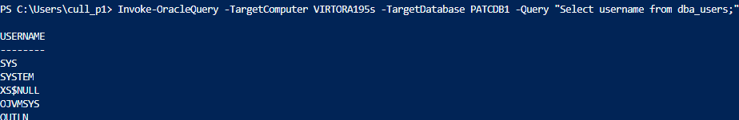
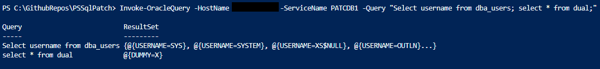
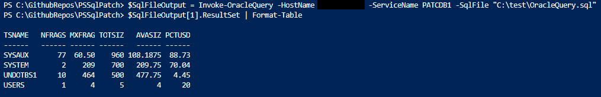
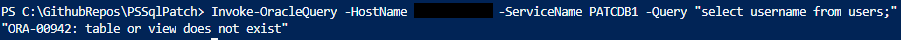
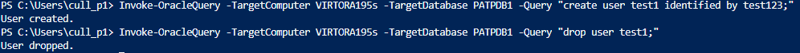

# Invoke-OracleQuery
This is a PowerShell function to query an Oracle database on Windows, using Windows Authentication or Oracle user credentials. The user can pass a query directly, or a SQL file to run against a database.

By default, the function connects to the target server using the current user credentials, and connects to the database as SYSDBA as the current user using Windows Authentication i.e. "connect /@DB as sysdba". Alternatively, you can specify the credentials to connect to the Target with "TargetCredential", and/or you can set the database user to connect with using "DatabaseCredential".

The function gets an Oracle Home on the TargetServer, and gets the Oracle.ManagedDataAccess.dll from there. This means there are no external dependencies. 

If there is only one query, the function returns the resultset in a PSObject as is. If there multiple queries, it creates a PSObject array that contains the Query and the ResultSet of that query. Examples of usage and output are below.

# Output Examples

### Simple Query
The below query demonstrates the resultset of a simple, single query passed via the Query variable.

```powershell 
Invoke-OracleQuery -TargetComputer VIRTORA195s -TargetDatabase PATCDB1 -Query "Select username from dba_users;" 
```
##### Output



### Multiple Queries
The below query demonstrates the resultset of a multiple queries passed via the Query variable. Note the Query and ResultSet properties.

```powershell 
Invoke-OracleQuery -TargetComputer VIRTORA195s -TargetDatabase PATCDB1 -Query "Select username from dba_users; select * from dual;" 
```
##### Output


### Using a SQL file
The below query demonstrates using a SQL file to query the database. We store the result in the $SqlFileOutput parameter, and then access the result set of the second query in the file.

```powershell 
$SqlFileOutput = Invoke-OracleQuery -TargetComputer VIRTORA195s -TargetDatabase PATCDB1 -SqlFile "C:\test\OracleQuery.sql"
$SqlFileOutput[1].ResultSet | Format-Table
```
##### Output



### Error/Success Messages
The function also returns error and success messages. This works in single queries and multiple queries. In the case of multiple queries, it gets stored in the ResultSet property.

##### Error Message


##### Success Message


## Alternative Credentials
```powershell 
$TargetCredential = Get-Credential 
$DatabaseCredential = Get-Credential -UserName "system"
Invoke-OracleQuery -TargetComputer VIRTORA195s -TargetDatabase PATCDB1 -Query "Select username from dba_users;" -TargetCredential $TargetCredential -DatabaseCredential $DatabaseCredential
```

## Argument Completer
The function also has an ArgumentCompleter for the TargetDatabase parameter. It does this by running "lsnrctl status" on the target, and parsing the result to contain only service names. Example screenshot is below;

