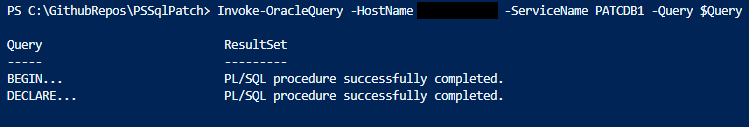

# Invoke-OracleQuery
This is a PowerShell module to query an Oracle database from Windows, using OS Authentication or database user credentials. The user can pass queries or SQL files to run against a database. It works for databases hosted on both Windows and Linux servers.

#### Dependencies
To access the database, the function uses ODP.NET dll files. The required file is located in the bin directory of this module, and is loaded automatically by the function.

# Output Examples

### Simple Query
The below query demonstrates the resultset of a simple, single query passed via the Query variable.

```powershell 
Invoke-OracleQuery -HostName HostServer1 -ServiceName PATCDB1 -Query "Select username from dba_users;" 
```
##### Output


### Multiple Queries
The below query demonstrates the resultset of a multiple queries passed via the Query variable. Note the Query and ResultSet properties.

```powershell 
Invoke-OracleQuery -HostName HostServer1 -ServiceName PATCDB1 -Query "Select username from dba_users; select * from dual;" 
```
##### Output


### Using a SQL file
The below query demonstrates using a SQL file to query the database. We store the result in the $SqlFileOutput parameter, and then access the result set of the second query in the file.

```powershell 
$SqlFileOutput = Invoke-OracleQuery -HostName HostServer1 -ServiceName PATCDB1 -SqlFile "C:\test\OracleQuery.sql"
$SqlFileOutput[1].ResultSet | Format-Table
```
##### Output


### Compatible with PL/SQL blocks
The function can parse SQL blocks correctly as well. It searches for commands within DECLARE and END commands or BEGIN and END commands. Examples of this is shown below;

```powershell
$Query = "
BEGIN
  DBMS_OUTPUT.put_line ('Hello World!');
END;
/

DECLARE
  l_message  
  VARCHAR2 (100) := 'Hello World!';
BEGIN
  DBMS_OUTPUT.put_line (l_message);
EXCEPTION
  WHEN OTHERS
  THEN
    DBMS_OUTPUT.put_line (SQLERRM);
END;
"

Invoke-OracleQuery -HostName HostServer1 -ServiceName PATCDB1 -Query $Query
```
##### Output


### Error/Success Messages
The function also returns error and success messages. This works in single queries and multiple queries. In the case of multiple queries, it gets stored in the ResultSet property.

##### Error Message


##### Success Message


## Alternative Credentials
The function also supports optionally using different credentials to connect to the database. If DatabaseCredential is not passed it connects as sysdba using OS Authentication. (similar to using "connect /@DbName as sysdba")

```powershell 
$DatabaseCredential = Get-Credential -UserName "system" -Message "Enter the user password"
Invoke-OracleQuery -HostName HostServer1 -ServiceName PATCDB1 -Query "Select username from dba_users;" -DatabaseCredential $DatabaseCredential
```
To connect as sysdba, you can do so by using;
```powershell 
$DatabaseCredential = Get-Credential -UserName "sys" -Message "Enter the user password"
Invoke-OracleQuery -HostName HostServer1 -ServiceName PATCDB1 -Query "Select username from dba_users;" -DatabaseCredential $DatabaseCredential -AsSysdba
```

## Argument Completer
The function also has an ArgumentCompleter for the ServiceName parameter. It does this by running "lsnrctl status" on the target, and parsing the result to contain only service names. This Argument completer will only work if the target Hostname is a Windows machine. Example screenshot is below;

